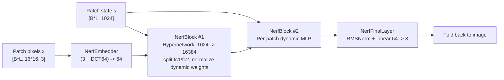
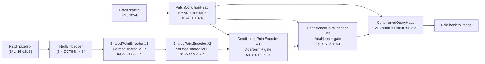

# Decoder Branch Comparison

This note summarizes the decoder path used by the `main` and `gaussian` branches for the current PixNerD class-conditional setup.

## Main Branch Decoder

Source: [PixGaussian_main/src/models/transformer/pixnerd_c2i.py](/home/hongbo/PixGaussian_main/src/models/transformer/pixnerd_c2i.py:251)

Current config dimensions:
- `s`: `1024`
- `x`: `64`
- decoder blocks: `2`
- patch size: `16`

Decoder intuition:
- `main` keeps the decoder tiny in token width (`64`), but each patch gets its own dynamically generated MLP weights from `s`.
- The dynamic weights are normalized before the two matrix multiplications, so the decoder has both high per-patch capacity and stable scale control.

## Gaussian Branch Decoder

Source: [PixGaussian/src/models/transformer/pixnerd_c2i.py](/home/hongbo/PixGaussian/src/models/transformer/pixnerd_c2i.py:251)

Current config dimensions after the patch:
- `s`: `1024`
- `condition`: `1024`
- `x`: `64`
- shared point depth: `2`
- point MLP hidden: `512`
- conditioned decoder blocks: `2`
- patch size: `16`

Decoder intuition:
- `gaussian` keeps the shared decoder idea: local point processing is shared across patches, while patch-specific information enters through a separate condition path.
- The patched version removes the severe `1024 -> 64` bottleneck, widens the point MLP to `512`, adds an extra shared point block, and restores normalization on the shared MLP weights plus the condition pathway.
- The conditioned projections are zero-initialized, so the decoder starts from a stable shared baseline and learns the patch-specific modulation gradually.
